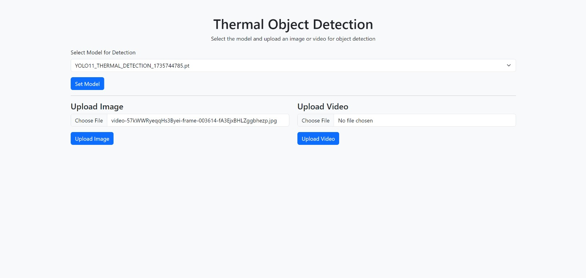
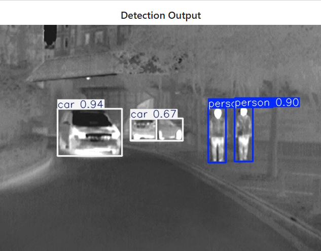
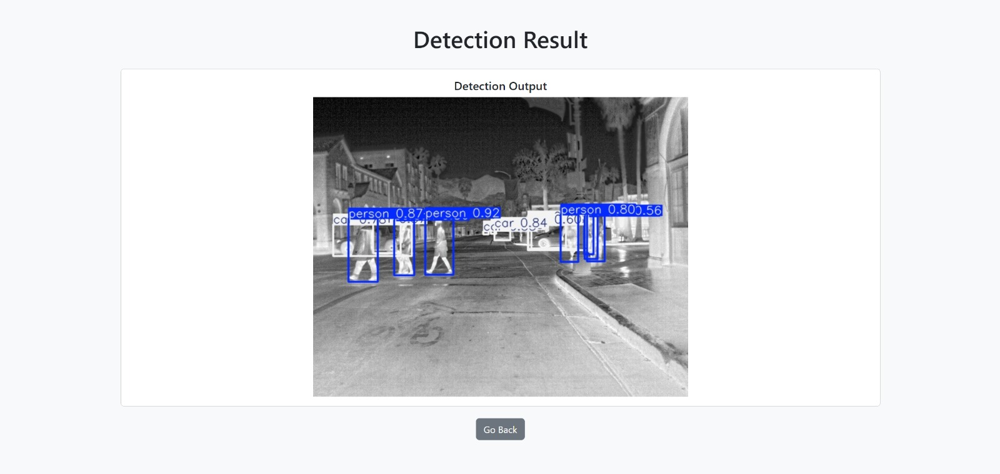
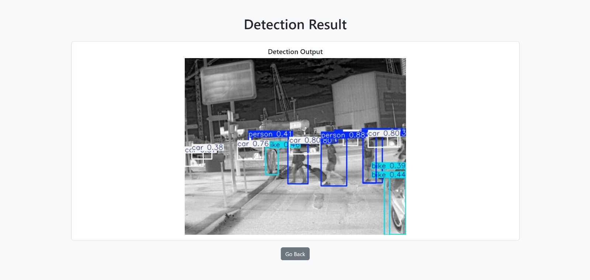

# Autonomous-Thermal-Vision

**Making autonomous vehicles safer by detecting pedestrians in real-time using thermal cameras.**

A Deep Learning-based system that detects humans in thermal images, specifically designed to improve autonomous vehicle navigation in low-visibility conditions such as night-time, fog, or poor lighting.

---
## 🎥 Demo

  
*Real-time thermal pedestrian detection on a road showing pedestrians being detected with bounding boxes.*

---

## Problem

Autonomous vehicles must reliably detect pedestrians and obstacles in challenging environments.  
Traditional RGB-based detection often fails in low-visibility scenarios, increasing the risk of accidents and reducing navigation safety.

---

## Solution

- Retrained a **state-of-the-art YOLOv8 detector** using a **custom thermal image dataset** simulating real-world pedestrian and obstacle scenarios.
- Dataset covers:
  - Pedestrians and obstacles at varying distances.
  - Diverse movement patterns.
  - Different environmental conditions (night, fog, heat variation).
- Developed a **web-based interface** to:
  - Upload thermal images and videos for human detection.
  - Dynamically manage multiple YOLO models.
  - Visualize detection results in real-time.
- Minimal dataset approach for efficient training without compromising accuracy.
- Transfer learning applied using a pretrained YOLO model with frozen backbone for optimized training.

---

## Outcome / Impact

- Accurate **human detection in thermal images** with minimal dataset usage.
- Enhanced **autonomous vehicle safety** by improving pedestrian and obstacle recognition in low-visibility scenarios.
- Portfolio-ready demonstration interface showcasing real-time detection results.
- Scalable framework for further research and deployment in real-world autonomous vehicle applications.

---

## Key Features

- Human detection in thermal images and videos.
- Training of new YOLO models on custom thermal datasets.
- Real-time visualization of detection results.
- Dynamic YOLO model management.
- Automatic video format conversion for easy playback.

---

## Tech Stack

- **Deep Learning:** YOLOv8 (Ultralytics)  
- **Web Interface:** Flask, HTML, CSS  
- **Database:** SQLite  
- **Video Processing:** MoviePy  

---

## Performance Metrics (50 Epochs, Transfer Learning)

- **Precision (Background):** ≈ 0.99  
- **Recall (Background):** ≈ 0.98  
- **mAP50 (Background):** ≈ 0.95  
- **mAP50-95 (Background):** ≈ 0.85  
- **Training Losses:**  
  - Box Loss: ≈ 0.55  
  - Class Loss: ≈ 0.25  
  - DFL Loss: ≈ 0.95  
- **Validation Losses:**  
  - Box Loss: ≈ 0.65  
  - Class Loss: ≈ 0.35  
  - DFL Loss: ≈ 0.96  

*Notes:* Transfer learning was applied using a YOLO pretrained model with frozen backbone.

---

## Portfolio Showcase

This project demonstrates:

- Expertise in deep learning model retraining and optimization.  
- Thermal image processing for real-world safety-critical applications.  
- Full-stack deployment with web interface for demonstration and evaluation.  
- Handling image/video data pipelines and model management for real-time applications.

---

## Demo / Visuals

- **Upload Page:** Interface for uploading thermal images/videos.  
  

- **Inference Result 1:** Detection output for example image 1.  
  

- **Inference Result 2:** Detection output for example image 2.  
  

- **Inference Result 3:** Detection output for example image 3.  
  

## Dataset & Credits

- This project uses the **FLIR Thermal Dataset** for training and evaluation.  
  - Dataset source: [FLIR Thermal Dataset](https://www.flir.com/oem/adas/adas-dataset-form/)  
  - **Note:** The dataset is **not included** in this repository due to licensing restrictions. Only trained model outputs and inference results are provided.

- This project leverages **YOLOv8** for human detection and transfer learning.  
  - Framework source: [Ultralytics YOLOv8](https://github.com/ultralytics/ultralytics)  

Special thanks to **FLIR Systems** for the dataset and **Ultralytics** for the YOLOv8 framework.
